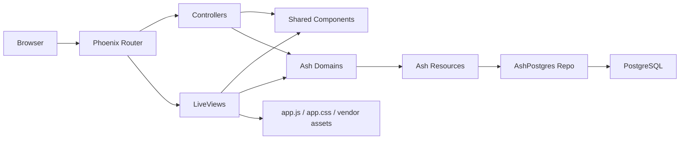

# Architecture

This repo is a Phoenix 1.8 + Ash + LiveView reference application with two distinct goals:

- operate as a small working app
- demonstrate production-style component and page patterns in a way that is easy to inspect and test

## System Map

### Domain Layer

- `lib/elixir_lizards/accounts.ex`
- `lib/elixir_lizards/accounts/user.ex`
- `lib/elixir_lizards/accounts/token.ex`

Ash owns the business/domain layer. Resources are declared in `lib/elixir_lizards/`, not in the web layer. Authentication, token storage, and admin exposure are configured declaratively on Ash resources and the Ash domain.

### Web Layer

- `lib/elixir_lizards_web/router.ex`
- `lib/elixir_lizards_web/controllers/`
- `lib/elixir_lizards_web/live/`
- `lib/elixir_lizards_web/components/`

Phoenix routes requests into either controllers or LiveViews. LiveViews render pages and showcases. Shared UI primitives live in `components/`.

### Data Layer

- `lib/elixir_lizards/repo.ex`
- `config/*.exs`

The runtime app uses `AshPostgres.DataLayer` and `ElixirLizards.Repo` for persistence. Ash resource changes should be expressed in the resource DSL and migrated with AshPostgres tooling rather than hand-written Ecto schema code.

### Asset Layer

- `assets/js/app.js`
- `assets/css/app.css`
- `assets/vendor/`

Phoenix 1.8 in this repo supports only the bundled `app.js` and `app.css` entrypoints. Vendor JS/CSS is imported through those bundles. Chelekom-generated assets are committed in `assets/vendor/`.

## UI Surfaces

### Main App

- `/`

Simple landing page and app entrypoint.

### Demo Pages

- `/demo`
- `/demo/dashboard`
- `/demo/features`
- `/demo/pricing`
- `/demo/team`
- `/demo/contact`
- `/demo/mapbox`

These are DaisyUI-first example pages. Their purpose is page composition, layout, and interaction examples.

### Component Showcases

- `/showcase`
- `/showcase/daisyui`
- `/showcase/chelekom`

These are component catalogs. Their purpose is discoverability, smoke coverage, and example usage.

### Dev Tooling

- `/dev/dashboard`
- `/dev/mailbox`
- `/admin`

These are enabled when `:dev_routes` is on. They are part of the repo's reference surface and are smoke-tested.

## Component Strategy

### DaisyUI

- App-facing components live in `lib/elixir_lizards_web/components/daisyui/`
- They are imported broadly through `elixir_lizards_web.ex`
- `/demo/*` and `/showcase/daisyui*` exercise them

### Chelekom

- Generated components live in `lib/elixir_lizards_web/components/chelekom/`
- They are intentionally not globally auto-imported
- `/showcase/chelekom` exercises them
- The library is kept as a dev-only generator dependency, while generated modules and vendored assets are committed

## Request Flow

1. `ElixirLizardsWeb.Router` matches the route.
2. Phoenix dispatches to a controller or LiveView.
3. LiveViews assemble pages from shared components.
4. Domain work is delegated to Ash resources and domains.
5. Persistence flows through AshPostgres into PostgreSQL.

## Reference Standards

This repo treats the following as part of its architecture, not just process:

- stable DOM ids on important LiveView surfaces
- smoke tests for public pages and dev tooling
- `mix precommit` as the local quality gate
- `mix hex.outdated` as the dependency drift check
- explicit documentation for Ash relationship patterns, especially `belongs_to` writes via foreign keys

## Relationship Guidance

For `belongs_to` relationships in Ash:

- prefer writing the foreign key directly, such as `content_id`, `run_id`, or `parent_id`
- use `:replace` or `:direct_control` semantics if you manage the relationship explicitly
- do not treat `belongs_to` like a collection relationship

That rule is documented in the pipeline RFD and reinforced by a test-only reference resource setup under `test/support/reference/`.
