# Reference QA

This guide captures the browser-visible surfaces that define the repo's reference quality.

## Local Commands

```sh
mix deps.get
mix phx.server
```

For verification and regression checks:

```sh
mix precommit
mix hex.outdated
```

## Visual Baselines

This repo keeps two baseline sets:

- desktop: `1440x1200`
- mobile: `390x844`

Refresh them against a running local app:

```sh
PORT=4100 mix phx.server
mix reference.screenshots --base-url http://127.0.0.1:4100
```

If your `browse` binary is not at the default Codex/gstack location, set `BROWSE_BIN=/absolute/path/to/browse`.
Treat these as reference composition/layout baselines, not pixel-perfect snapshot tests.

## Main App Surface

### `/`

Expected:

- landing page loads successfully
- primary navigation links to `/demo` and `/showcase`
- marketing copy references Phoenix, Ash, LiveView, and the component libraries

Reference screenshots:

Desktop:
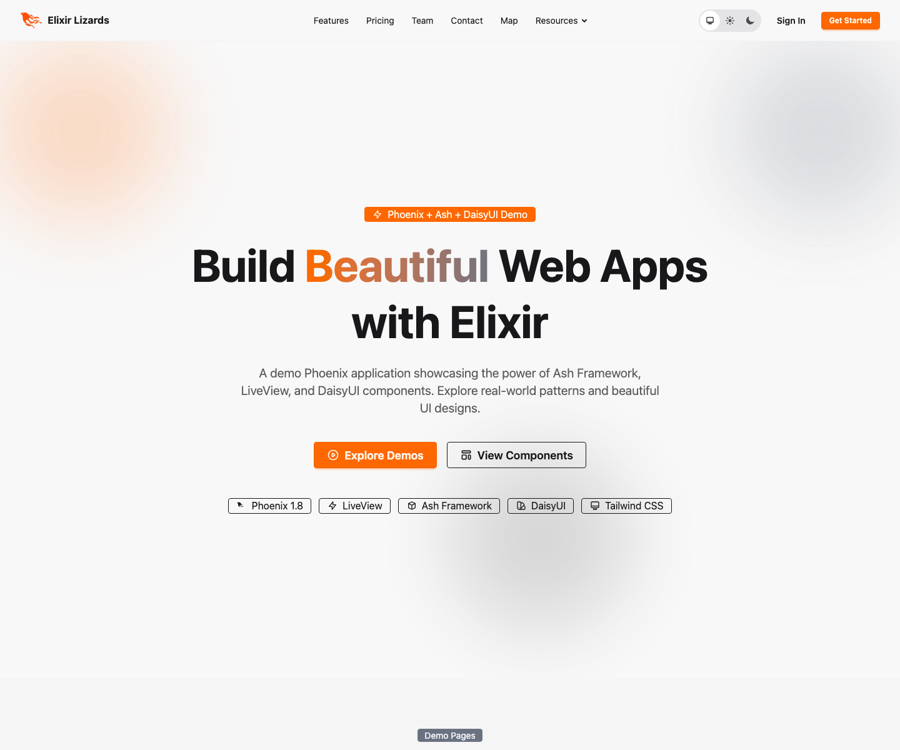

Mobile:
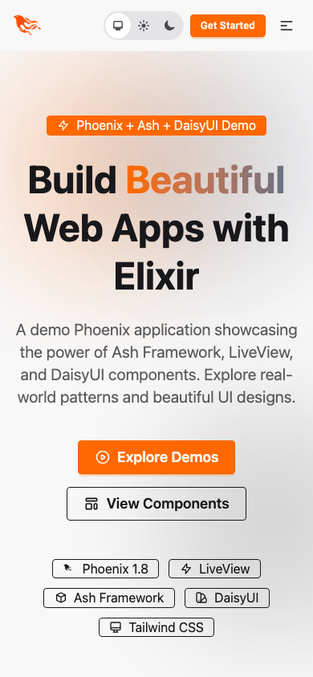

Automated coverage:

- `test/elixir_lizards_web/controllers/page_controller_test.exs`

## Demo Surfaces

### `/demo`

Expected:

- demo index renders
- cards for the main DaisyUI demo pages are visible

Reference screenshots:

Desktop:
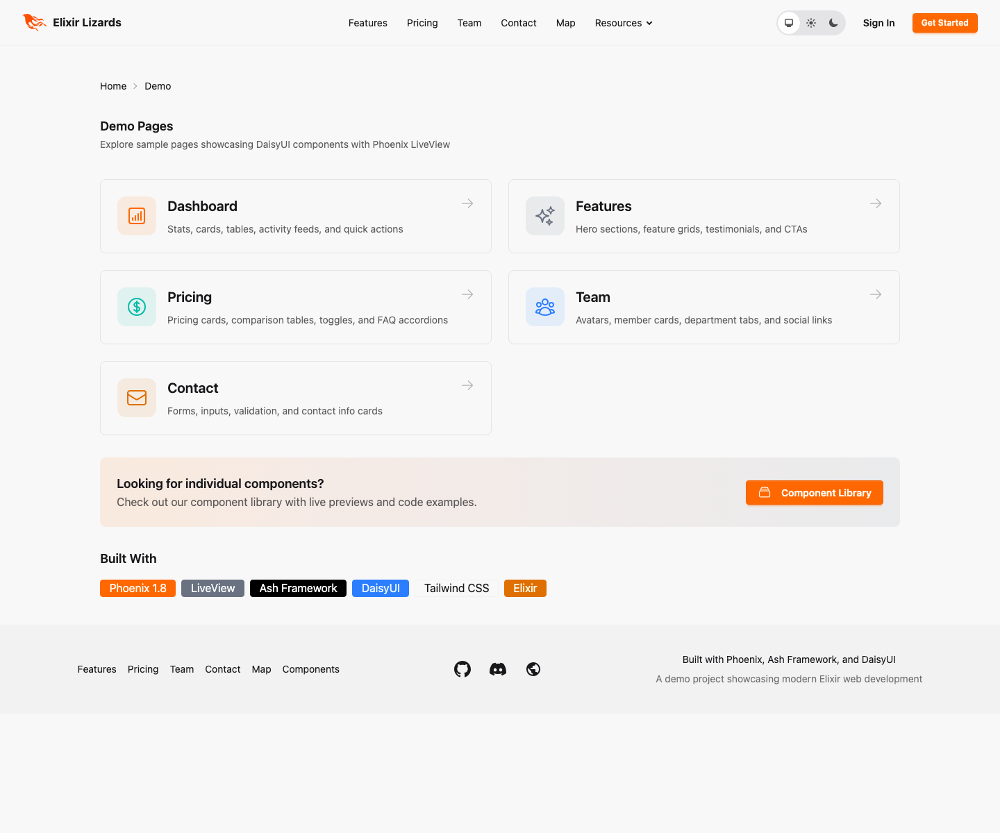

Mobile:
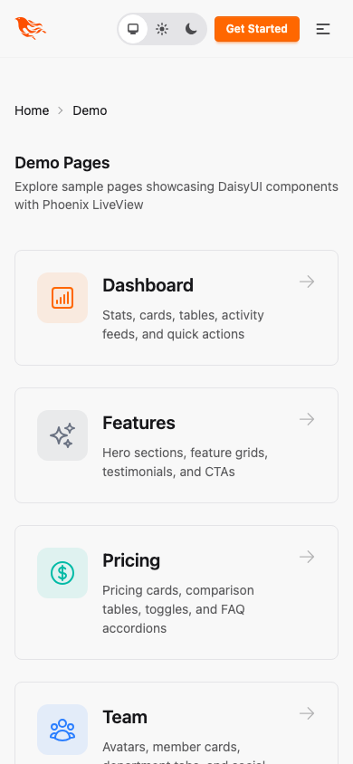

### `/demo/dashboard`

Expected:

- "Recent Projects" section renders
- "Quick Actions" section renders

### `/demo/features`

Expected:

- hero content renders
- testimonial section renders

### `/demo/pricing`

Expected:

- pricing cards render
- comparison table renders

### `/demo/team`

Expected:

- leadership section renders
- team/department sections render

### `/demo/contact`

Expected:

- `#contact-form` exists
- submit flow should show a success flash when exercised manually

### `/demo/mapbox`

Expected:

- page renders regardless of token presence
- with no token, the "Mapbox Token Required" state renders
- with `MAPBOX_ACCESS_TOKEN` configured, `#mapbox-container` renders and the map initializes

Automated coverage:

- `test/elixir_lizards_web/live/demo_pages_test.exs`

## Showcase Surfaces

### `/showcase`

Expected:

- `#showcase-library-index` exists
- DaisyUI and Chelekom library cards render
- component counts are populated

Reference screenshots:

Desktop:
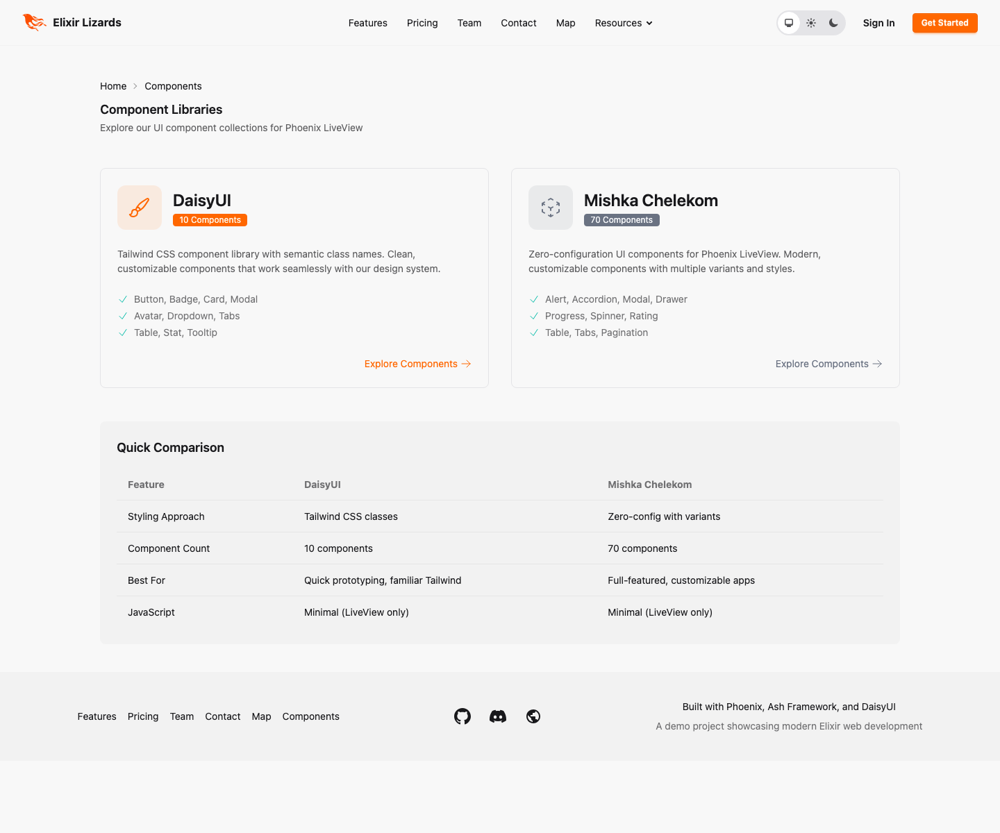

Mobile:
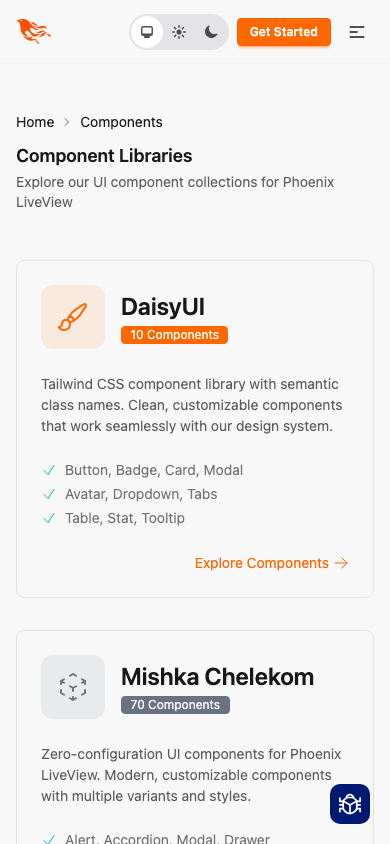

### `/showcase/daisyui`

Expected:

- `#daisyui-showcase` exists
- `#daisyui-component-count` matches the catalog
- each component card has a stable DOM id

Reference screenshots:

Desktop:
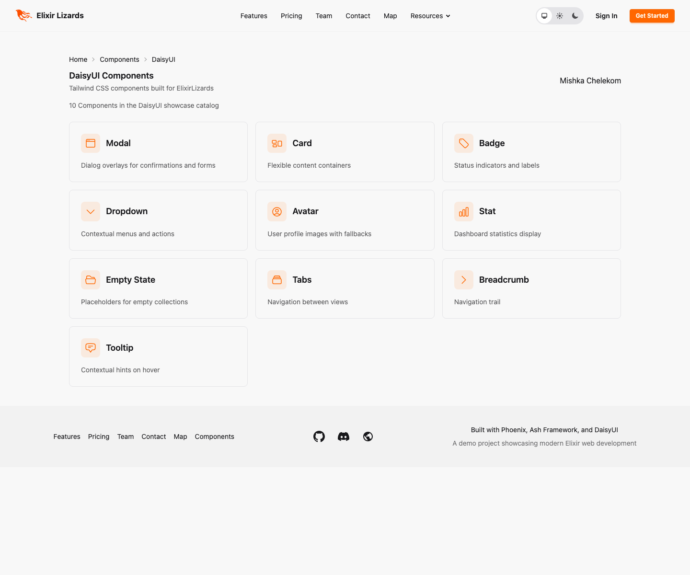

Mobile:
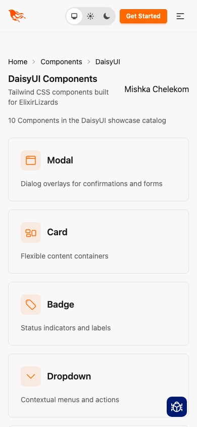

### `/showcase/chelekom`

Expected:

- `#chelekom-showcase` exists
- `#chelekom-component-count` matches the installed catalog
- category filter buttons switch visible sections cleanly

Reference screenshots:

Desktop:
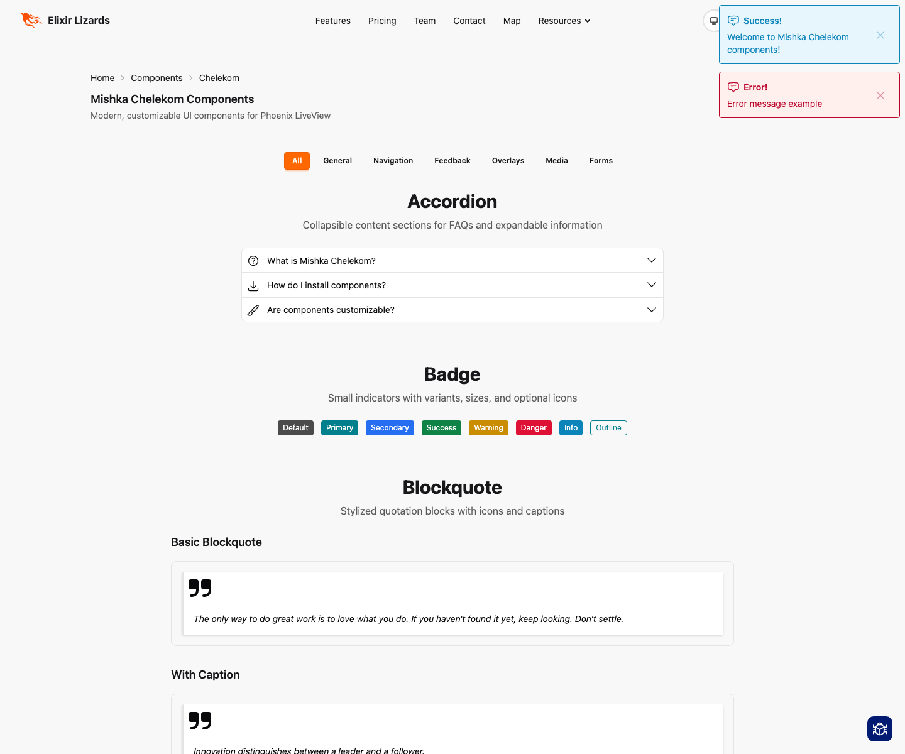

Mobile:
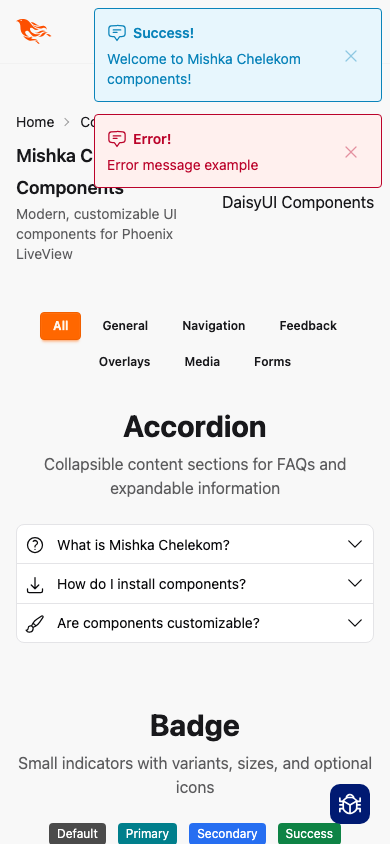

Automated coverage:

- `test/elixir_lizards_web/live/showcase/component_index_live_test.exs`
- `test/elixir_lizards_web/live/showcase/daisyui/component_demo_live_test.exs`
- `test/elixir_lizards_web/live/showcase/chelekom/component_demo_live_test.exs`

## Dev Tooling Surfaces

These routes require `:dev_routes` to be enabled.

### `/dev/dashboard`

Expected:

- route redirects to `/dev/dashboard/home`
- LiveDashboard renders

Reference screenshots:

Desktop:
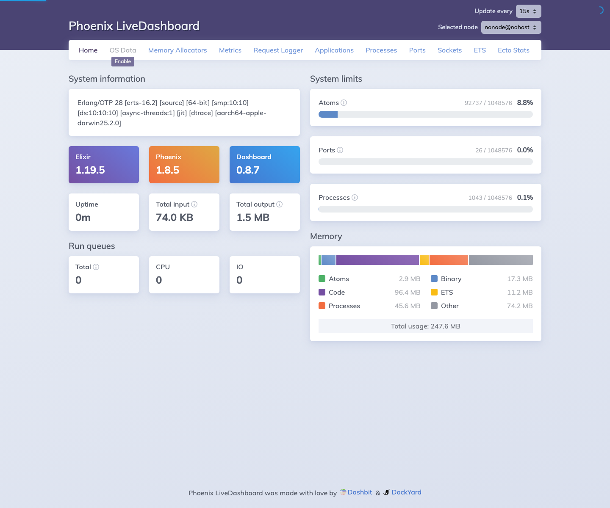

Mobile:
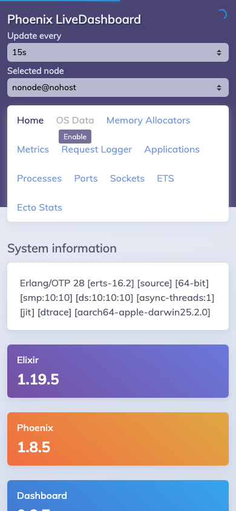

### `/dev/mailbox`

Expected:

- Swoosh mailbox preview renders

Reference screenshots:

Desktop:
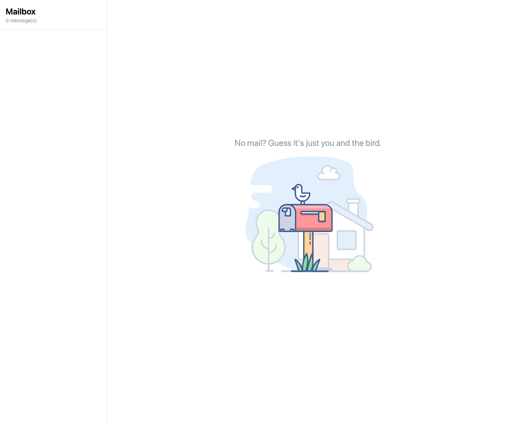

Mobile:
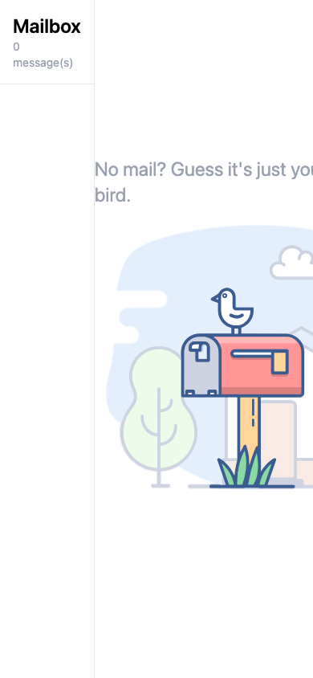

### `/admin`

Expected:

- Ash Admin UI renders

Reference screenshots:

Desktop:
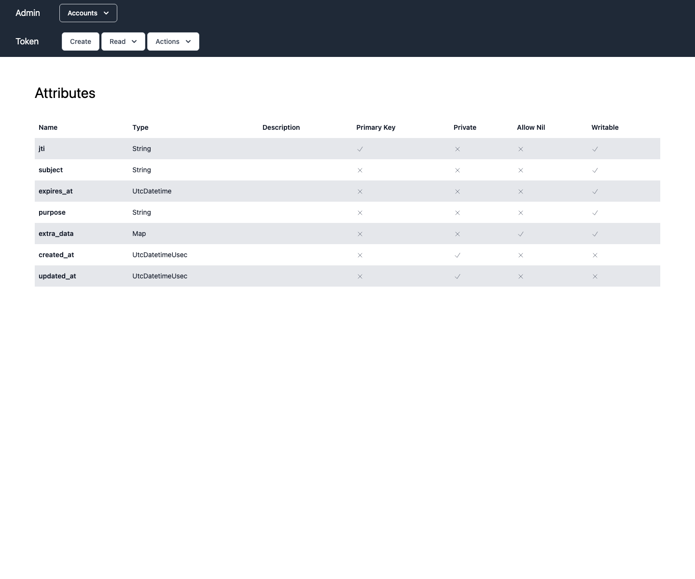

Mobile:
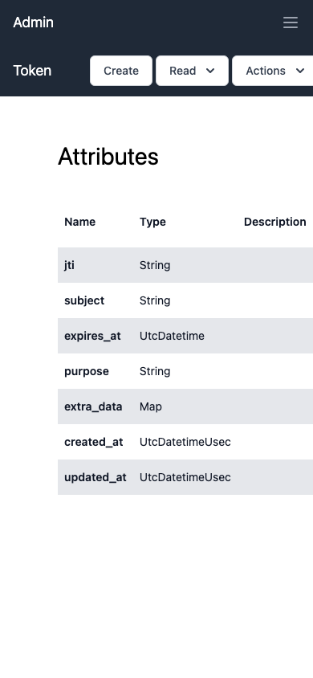

Automated coverage:

- `test/elixir_lizards_web/controllers/dev_routes_test.exs`

## Relationship Reference Surface

The repo also treats the Ash `belongs_to` write pattern as part of its reference surface.

Expected:

- foreign-key writes such as `parent_id`, `content_id`, and `run_id` are treated as the canonical `belongs_to` write pattern
- docs do not recommend `manage_relationship(..., type: :append)` for `belongs_to`

Automated coverage:

- `test/elixir_lizards/ash_relationship_reference_test.exs`
